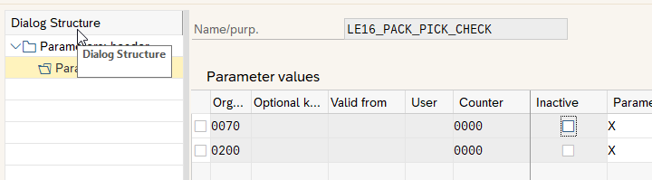

# General customizing table for ABAP
## Use case
If there is a need for new customizing parameters in customer projects, we usually create tables, views, view clusters, access routines and so on. What if we used one single table for this? We would have an unique access module and could store as many parameters as we want using an access key. 

## Real-life experiences
I used this approach for many years in a mid-range implementation with about 3000 Users. It makes the developing more straightforward when it comes to use settings stored in the database. After 4 years, about 250 different parameter keys accumulated in our generic table. In case we have special requirements such as proper validation of values against domains or check tables, we continue using normal customizing features, but in case of simple setup parameters, the generic table is very helpful.

## Features
* General customizing tables
* Possibility to set validity dates and user ids (for testing)
* Usage with our without change requests (customizing or non-customizing)
* Possibility to store structure-like parameters (see `ZP_GENCUST_DEMO_STRUCTURE`)
* Possibility to store multi-value parameters (see `ZP_GENCUST_DEMO_MULTIPLE`)

## Usage notes
### Maintaining the tables
There are two (identical) sets of customizing tables: `ZDB_GENCUSTHD` `ZDB_GENCUSTIT` and `ZDB_GENCUSTHD2` `ZDB_GENCUSTIT2`. The latter ones are tables with no transport link. They are intended for maintaining directly in the production system (for example, if material numbers, customer codes, address numbers ore anything else concerning master data is to be stored). The others are normal customizing with link to the transport system.

I recommend creating two view clusters, for each pair of tables one. See the example here:

We also created parameter transactions (based on SM34) to quickly maintain the data.

The header table contains the following fields:
1. Purpose key: the general access key for this parameter set
2. SAP Module: The top-level ERP module (MM, PP...) where the parameter is used
3. Description of the parameter
4. Description that contains info on the organization level that is being used (could be plant, company key or even a concatenation of levels such as sales org / distr. chan / division)

The item table has the following:
1. Purpose key
2. Org level: a general-purpose key (20 chars) to qualify the setting. Could be a "real" org. level but also any another structural characteristic from the business model
3. Optional key: in some cases, a single key is not sufficient. Here, this key comes handy
4. Valid from: This special parameter can be used to make a row valid from a specific date on. It could be helpful if you want to activate a new feature on a key date
5. User: This is for the test phase of the project. One can activate the setting only for a specific user
6. Counter: If a multi-value parameters is required, use the counter and create several lines with the same key but incremental counter. Make sure to not mix values with counters and those without for one purpose key
7. Inactive: activating this checkbox wil make the reader class not consider the row
8. Parameter value: 255 characters to store the value of the parameter
9. Parameter description: if needed, each parameter can be described here

### Using the reader class
The reader class is instantiated by a factory:

      settings_reader =
        cond #(
          when input = abap_true
            then zcl_gencust_factory=>get_main_nocust( parameter_purpose )
            else zcl_gencust_factory=>get_main( parameter_purpose ) ).
            
As shown in the example, there are two options: instantiate the customizing variant (`ZDB_GENCUSTHD` `ZDB_GENCUSTIT`) or the non-customizing one.

Reading the values

        data(settings_value) = settings_reader->single( plant ).

The read methods implement the return pattern, thus they return an object that can be used to get the value that has been read, but also to determine if a value exists or not.

        if settings_value->is_ok( ).
          cl_demo_output=>display( |Value found: { settings_value->get_value( ) }| ).
        else.
          cl_demo_output=>display( settings_value->get_error( ) ).
        endif.

### Demo reports

Refer to the `ZP_GENCUST_DEMO*` reports to learn more about how to use the features
