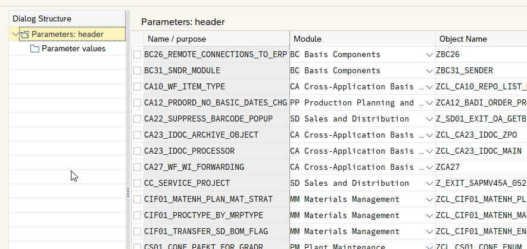

# General customizing table for ABAP
## Use case
If there is a need for new customizing parameters in customer projects, we usually create tables, views, view clusters, access routines and so on. What if we used one single table for this? We would have an unique access module and could store as many parameters as we want using an access key. 

## Real-life experiences
I used this approach for many years in a mid-range implementation with about 3000 Users. It makes the developing more straightforward when it comes to use settings stored in the database. After 4 years, about 250 different parameter keys accumulated in our generic table. In case we have special requirements such as proper validation of values against domains or check tables, we continue using normal customizing features, but in case of simple setup parameters, the generic table is very helpful.

## Usage notes
There are two sets of customizing tables: `ZDB_GENCUSTHD` `ZDB_GENCUSTIT` and `ZDB_GENCUSTHD2` `ZDB_GENCUSTIT2`. The latter ones are table with no transport link. They are intended for maintaining directly in the production system (for example, if material numbers, customer codes, address numbers ore anything else concerning master data is to be stored). The others are normal customizing with link to the transport system.

I recommend creating two view clusters, for each pair of tables one. See the example here:

